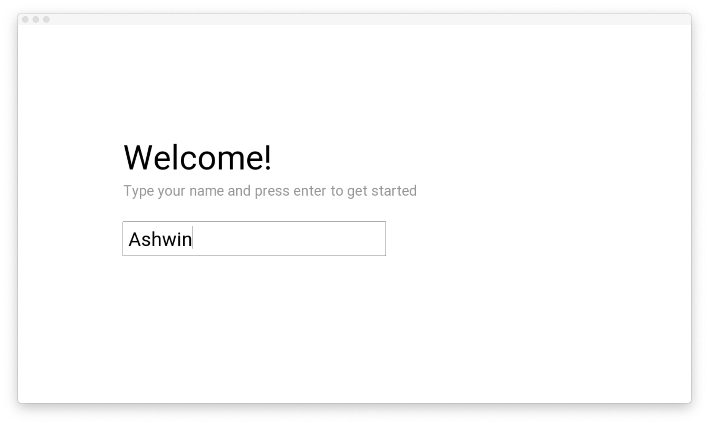
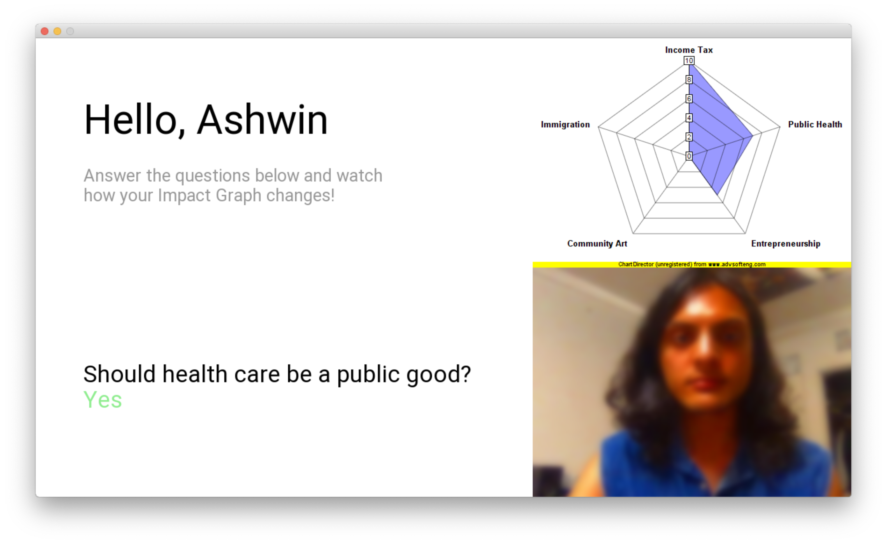

# Discover Your Impact - Kiosk
An OpenFrameworks application to help passerbys learn about their views and their impact through a series of yes/no questions

## Overview
- The app first presents a login view, prompting for the user's name.
- Questions and categories are loaded from `/data/questions.json`.
- On the main screen, **answer questions by pressing the "Y" or "N" key on your keyboard**.
  - Eventually this could be replaced by dedicated hardware buttons on the kiosk. `handleYesNo( )` provides a modular event handler; simply pass it `true` for "yes" and `false` for "no".
- The Impact Graph is a Radar Chart that depicts the cumulative impact on each category.
  - The Graph appears after the first question is answered.
  - The Graph ignores an axis if it's total value is negative.
- A webcam picture is taken every time the user answers a question. It is filtered according to the question's impact.
  - The *saturation* is scaled by the (absolute) **mean value** of impact across all categories.
  - The *bluriness* is determined by the **range** of the impact values.
- The program shows the picture for 4 seconds before loading the next question.
  - This can be changed with the `QUESTION_DELAY` constant.
- The picture is saved at `/data/USER_NAME/QUESTION_NUMBER.jpg`. e.g. `/data/Ashwin/2.jpg`
- A short summary is logged to console after each question.

## Installation

### OpenFrameworks add-ons
Install these add-ons into your `of/addons` folder:
- [ofxAsync](https://github.com/funatsufumiya/ofxAsync) (for running threads)
- [ofxBlur](https://github.com/kylemcdonald/ofxBlur)
- [ofxJSON](https://github.com/jeffcrouse/ofxJSON)
- [ofxUIUtils](https://github.com/aaga/ofxUIUtils)
  - **Note:** This is my own fork of the add-on that removes the need for Cinder. I think it may be a bug in the original.

### Xcode (adding ChartDirector library to the app)
I tried my best to package ChartDirector (used to produce the Radar Chart) using Xcode's build settings. However depending on your setup, you may have to redo some settings. In particular, if you use OpenFramework's `projectGenerator`, it will wipe most if not all of these settings.

In short, if you're running into problems, look over this list:
- Go to Target Settings > General
  - Add `src/chartdir/lib/libchartdir.6.dylib` to "**Embedded Binaries**"
  - Do the same for "**Linked Frameworks and Libraries**"
- Go to Target Settings > Build Settings
  - Find "**Runpath Search Paths**" and add an entry for all schemes: `@executable_path/../Frameworks`
- [Highly unlikely you wil have to do this]
  - The `.dylib` file in the repo is already configured correctly (I think!), but if you're still crashing at runtime, run this in Terminal: `install_name_tool -id "@rpath/libchartdir.6.dylib" $PATH_TO_libchartdir.6.dylib`. This configures the library to use relative paths.

## Future considerations
- Right now the app cycles through the questions (to allow you to play around) but the final version could have a summary screen after you've answered all the questions.
- App should timeout and reset back to login screen after a few minutes of inactivity.
- Would like to play around more with the image filters.
- Would like to add animations and smoother transitions.
